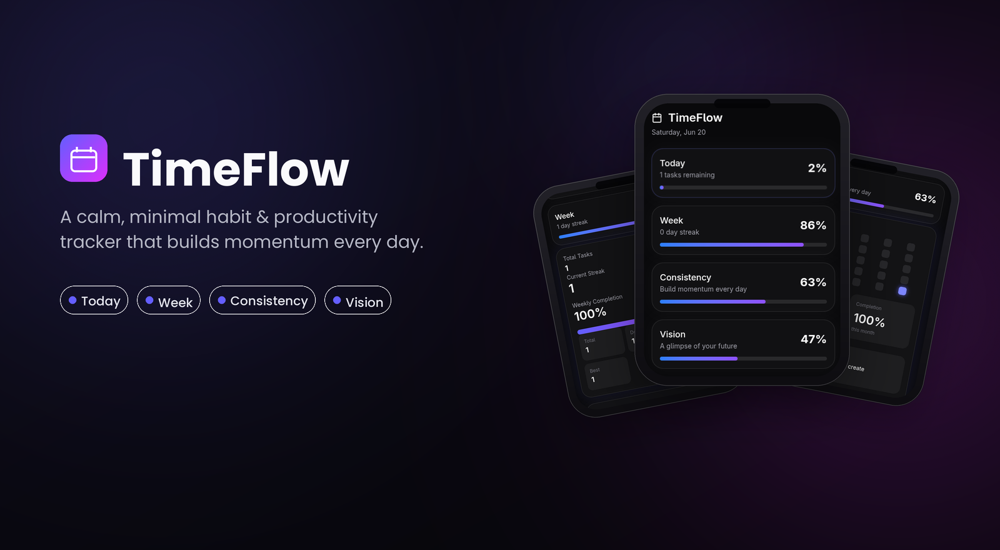
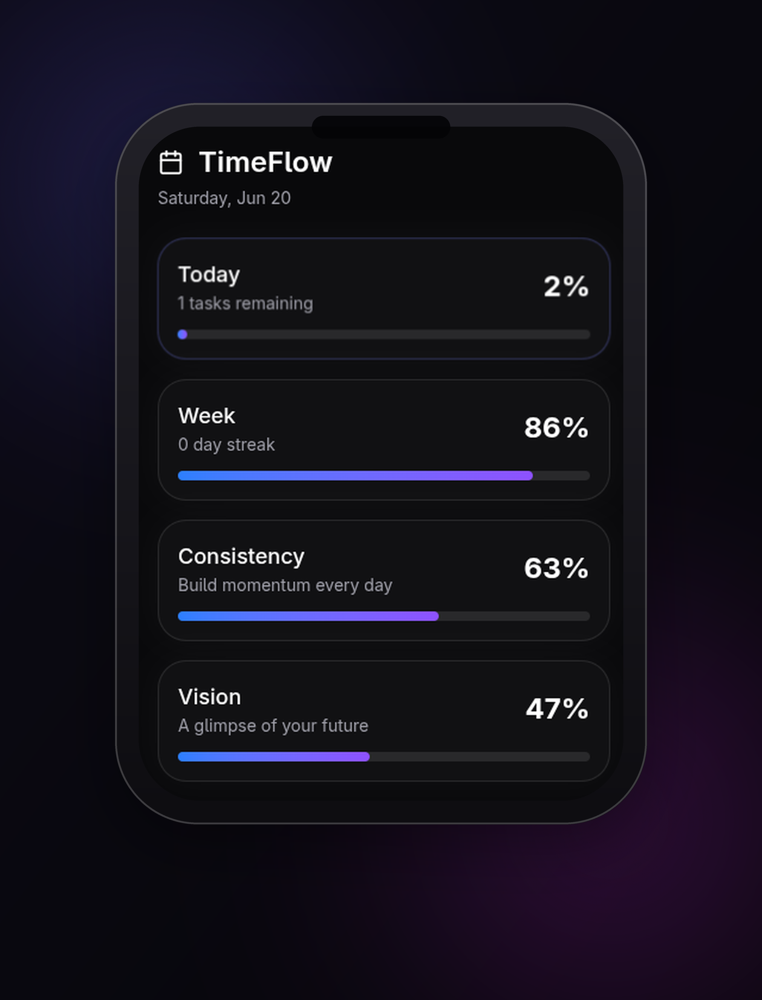
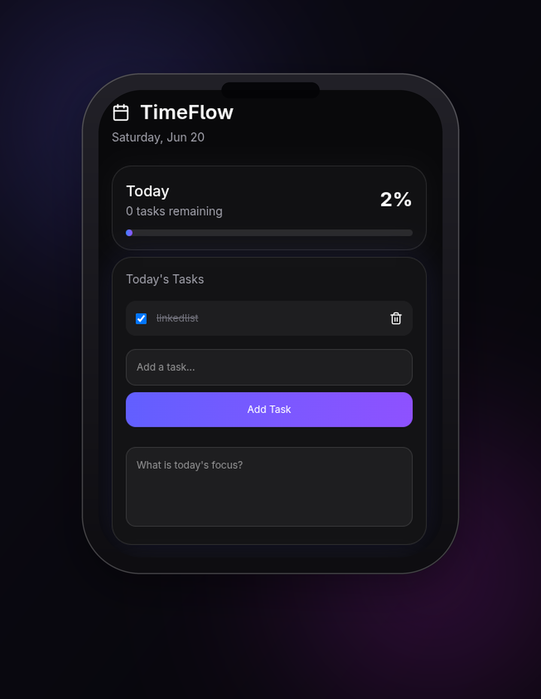
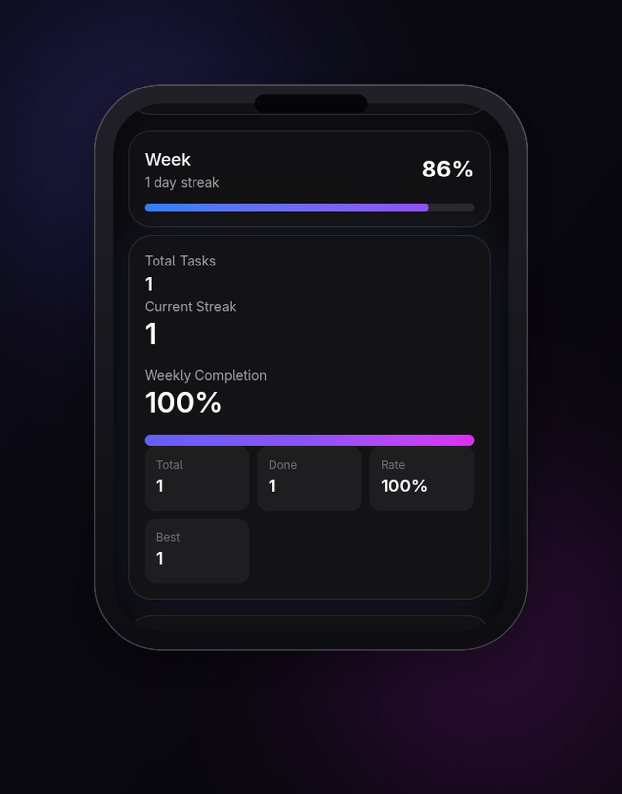
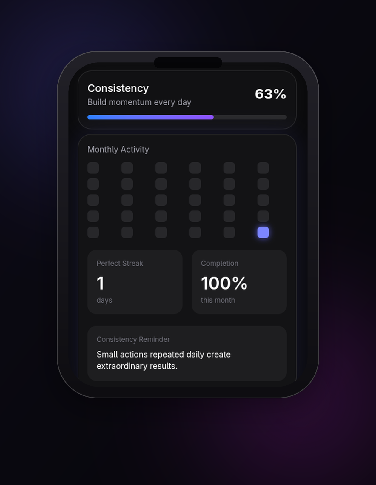
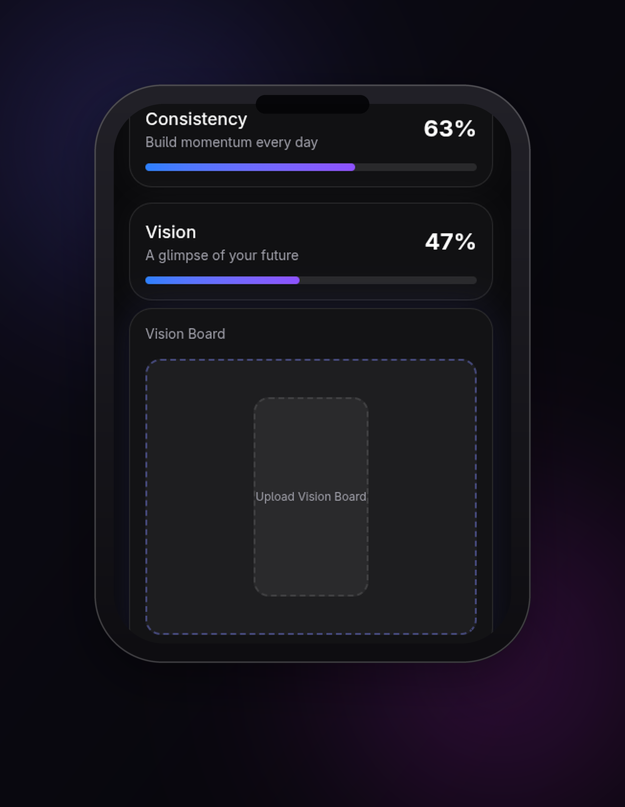
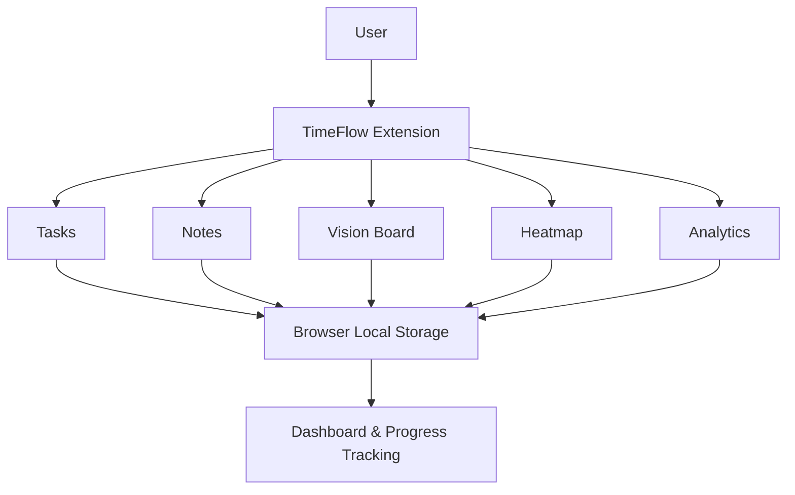

# TimeFlow

<div align="center">


### Visualize Time • Build Consistency • Achieve More

A modern Chrome productivity extension that helps users track daily progress, build streaks, maintain consistency, and stay focused on long-term goals.

<br/>


</div>

---

# Overview

TimeFlow is a lightweight productivity operating system built around a simple idea:

> Small actions repeated consistently create extraordinary results.



Unlike traditional task managers that focus only on completing to-do lists, TimeFlow combines task management, streak tracking, contribution heatmaps, time visualization, analytics, daily reflection, and vision boards into a single distraction-free experience.

The goal is not just to help users finish tasks.

The goal is to help users build momentum.

---

# Why TimeFlow?

Most productivity applications become overwhelming over time.

They introduce endless settings, complex dashboards, and unnecessary friction.

TimeFlow takes a different approach.

It focuses on four essential perspectives:

### Today

What matters right now.

### Week

How your consistency is developing.

### Consistency

Visual proof of your habits over time.

### Vision

A reminder of where you're ultimately going.

Together, these views help users maintain awareness of both short-term execution and long-term growth.

---

# Features

## Real-Time Time Tracking

Track the live progress of:

* Day
* Week
* Month
* Year

Time updates automatically and provides constant awareness of how time is passing.

---

## Daily Task Management

Create and manage tasks effortlessly.

Features include:

* Add Tasks
* Complete Tasks
* Delete Tasks
* Progress Tracking
* Daily Completion Percentage

---

## Smart Carry Forward

Unfinished tasks automatically move into the next day.

This ensures important work is never lost.

---

## Daily Focus Notes

Capture:

* Daily Priorities
* Study Plans
* Work Goals
* Reflections
* Ideas

Notes are automatically persisted between sessions.

---

## Perfect Day Streaks

Build momentum through consistency.

TimeFlow tracks:

* Current Streak
* Perfect Day Streak
* Weekly Completion Rate

A Perfect Day is achieved when every task scheduled for that day is completed.

---

## Weekly Analytics

Monitor productivity through:

* Total Tasks
* Completed Tasks
* Completion Rate
* Current Streak
* Consistency Metrics

---

## GitHub-Style Heatmap

Inspired by GitHub and LeetCode.

The heatmap visualizes daily productivity and consistency patterns over time.

Users can instantly identify:

* Productive periods
* Missed days
* Habit trends
* Momentum streaks

---

## Monthly Goals

Track larger objectives such as:

* Learning Goals
* Fitness Goals
* Reading Goals
* Project Goals
* Personal Challenges

---

## Vision Board

Upload images that represent future aspirations.

Examples include:

* Career Goals
* Health Goals
* Travel Goals
* Dream Lifestyle
* Personal Growth

The Vision Board acts as a daily reminder of why consistency matters.

---

# Screenshots

A quick look at TimeFlow's core productivity workflow.

<table>
<tr>

<td align="center">

<br/>
<b>Overview</b>
</td>

<td align="center">

<br/>
<b>Today's Tasks</b>
</td>

<td align="center">

<br/>
<b>Weekly Analytics</b>
</td>

<td align="center">

<br/>
<b>Consistency</b>
</td>

<td align="center">

<br/>
<b>Vision Board</b>
</td>

</tr>
</table>

---


# Product Vision

TimeFlow is designed to become more than a productivity extension.

The long-term vision is to build a personal productivity platform that helps users:

* Understand how they spend time
* Build sustainable habits
* Track long-term growth
* Maintain consistency
* Stay connected to meaningful goals

The focus is not on productivity for productivity's sake.

The focus is on intentional progress.

---
## Architecture



# Design Principles

### Simplicity

Reduce friction.

### Visibility

Make progress obvious.

### Consistency

Reward repeated action.

### Persistence

Preserve important information.

### Accessibility

Useful for students, professionals, creators, entrepreneurs, researchers, and lifelong learners.

---

# Scalability

TimeFlow is currently powered by local browser storage for speed and privacy.

The architecture has been designed to support future expansion, including:

* Google Account Integration
* Cloud Synchronization
* Cross Device Access
* Team Productivity Spaces
* Shared Goals
* Advanced Analytics Infrastructure
* Mobile Applications

The component-driven architecture allows new modules to be added without major restructuring.

---

# Reliability

TimeFlow is designed to work entirely offline.

Core functionality remains available without internet access:

* Tasks
* Notes
* Streaks
* Analytics
* Heatmaps
* Vision Boards

Users retain access to their productivity system regardless of network availability.

---

# Privacy

Privacy is a core principle of TimeFlow.

Current versions:

* Store data locally
* Do not track browsing activity
* Do not collect personal information
* Do not share data with third parties

Future synchronization features will remain completely optional.

---

# Testing

TimeFlow is actively tested throughout development.

### Functional Testing

* Task Creation
* Task Completion
* Task Deletion
* Streak Calculations
* Analytics Calculations
* Vision Board Persistence
* Notes Persistence

### Storage Testing

Verification across:

* Browser Refreshes
* Browser Restarts
* Extension Reloads

### User Interface Testing

Validation of:

* Responsive Layouts
* Popup Rendering
* Dark Theme Consistency
* User Experience Flow

### Performance Testing

Monitoring:

* Extension Startup Time
* Rendering Performance
* Storage Operations
* Animation Smoothness

---

# Architecture

```text
src/
├── components/
│   ├── Header.tsx
│   ├── ProgressCard.tsx
│   ├── TaskItem.tsx
│   └── Heatmap.tsx
│
├── hooks/
│   └── useTasks.ts
│
├── utils/
│   ├── progress.ts
│   ├── streaks.ts
│   ├── stats.ts
│   ├── notes.ts
│   ├── vision.ts
│   ├── heatmap.ts
│   ├── storage.ts
│   └── carryForward.ts
│
├── types/
│   └── task.ts
│
├── App.tsx
└── main.tsx
```

---

# Tech Stack

### Frontend

* React
* TypeScript
* Vite

### UI

* Tailwind CSS

### Browser Platform

* Chrome Extension Manifest V3

### Storage

* Browser Local Storage API

---
# Chrome Extension Installation

TimeFlow can be installed manually in Google Chrome using Developer Mode.

### Step 1 — Download

Download the latest release:

```text
TimeFlow-v1.0.zip
```

from the Releases page.

### Step 2 — Extract

Extract the ZIP file to a folder on your computer.

You should see files similar to:

```text
manifest.json
index.html
assets/
logo/
```

### Step 3 — Open Chrome Extensions

Navigate to:

```text
chrome://extensions
```

### Step 4 — Enable Developer Mode

Turn on **Developer Mode** using the toggle in the top-right corner.

### Step 5 — Load Extension

Click:

```text
Load unpacked
```

and select the extracted TimeFlow folder.

### Step 6 — Pin TimeFlow

Click the Extensions icon in Chrome and pin **TimeFlow** for quick access.

### Step 7 — Start Tracking

Open TimeFlow and begin:

* Managing tasks
* Tracking streaks
* Monitoring progress
* Building consistency
* Maintaining your vision board

---

### Updating TimeFlow

When a new version is released:

1. Download the latest release.
2. Replace the old extension files.
3. Open:

```text
chrome://extensions
```

4. Click the **Reload** button on TimeFlow.

Your locally stored data will remain intact.

---

### Troubleshooting

#### Extension shows a blank screen

Reload the extension from:

```text
chrome://extensions
```

and ensure you are using the latest release.

#### Changes are not visible

Click the **Reload** button in Chrome Extensions.

#### Data is missing

TimeFlow stores data locally in your browser. Avoid clearing browser storage if you want to preserve your progress.


# Installation

Clone the repository:

```bash
git clone https://github.com/sravanya-2006/Track_Progress.git
```

Navigate into the project:

```bash
cd Track_Progress
```

Install dependencies:

```bash
npm install
```

Run development mode:

```bash
npm run dev
```

Build the extension:

```bash
npm run build
```

---

# Load Extension

1. Open Chrome

2. Navigate to:

```text
chrome://extensions
```

3. Enable Developer Mode

4. Click Load Unpacked

5. Select the `dist` folder

6. Pin TimeFlow to the toolbar

---

# Roadmap

## Near-Term

* Achievement System
* Better Analytics
* Improved Heatmap
* Goal Tracking Enhancements
* Data Export / Import

## Long-Term

* Google Account Sync
* Cloud Backups
* Mobile Companion App
* AI Productivity Insights
* Calendar Integrations
* Habit Tracking System
* Team Workspaces

---

# Contributing

Contributions, suggestions, feature requests, and bug reports are welcome.

1. Fork the repository
2. Create a feature branch
3. Commit your changes
4. Push the branch
5. Open a Pull Request

---

# License

Distributed under the MIT License.

See the LICENSE file for more information.

---

# Author

### Sravanya

GitHub: https://github.com/sravanya-2006

---

<div align="center">

### Built to help people spend their time intentionally.

⭐ If you found TimeFlow useful, consider starring the repository.

</div>
